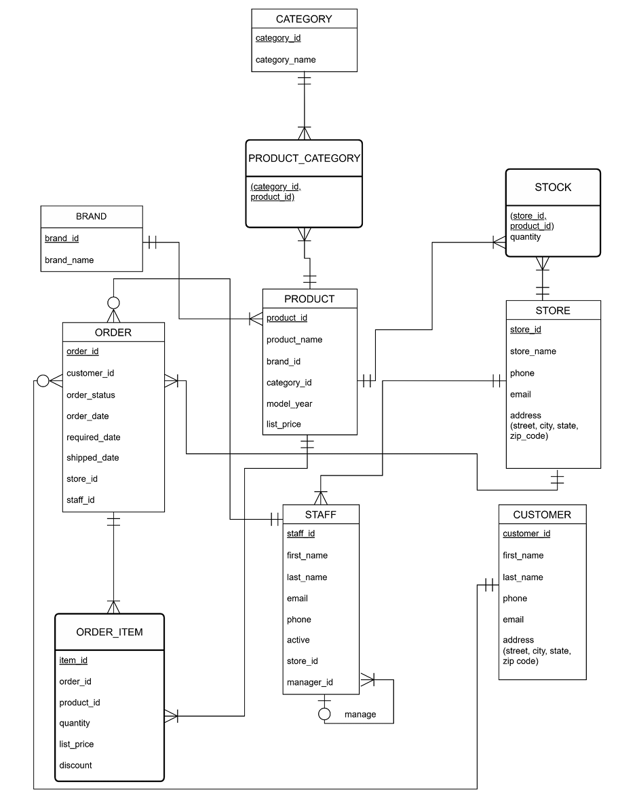
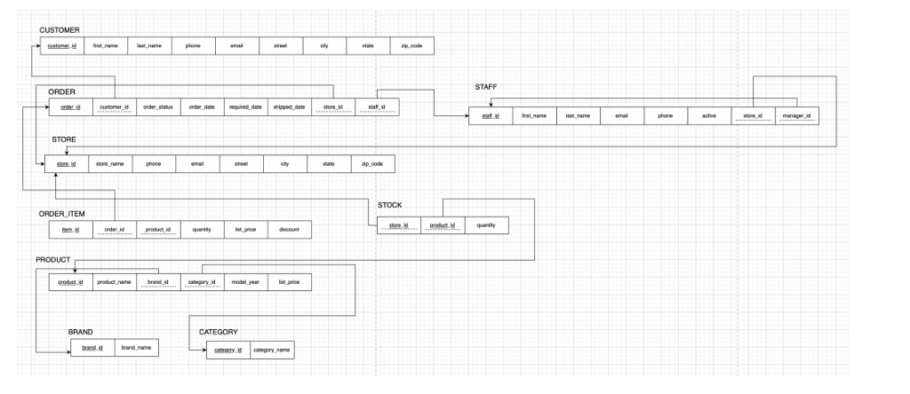
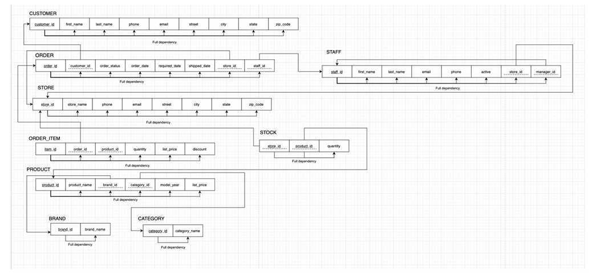
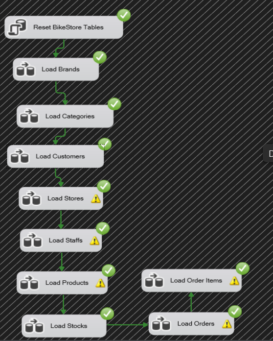
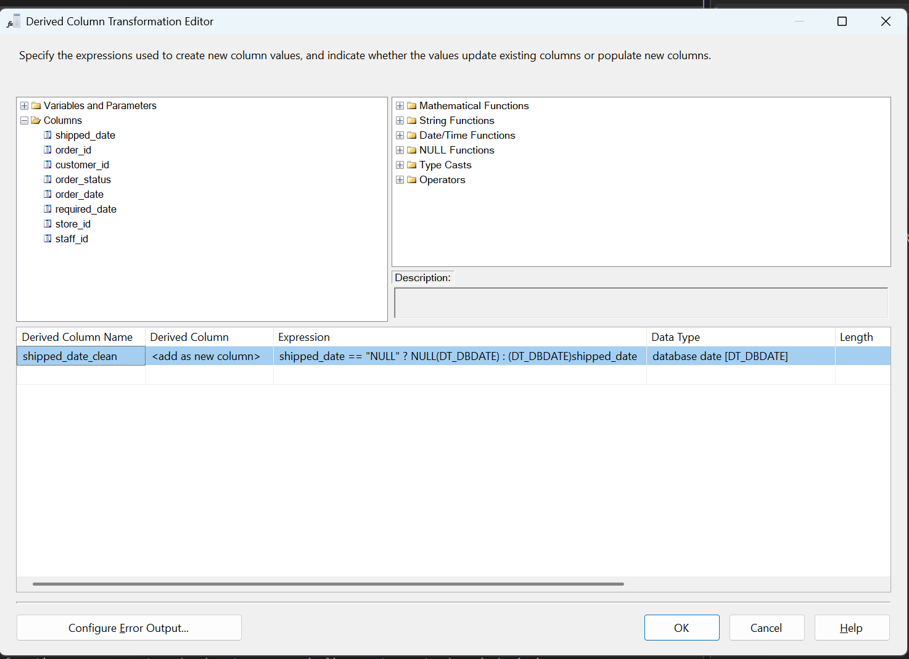
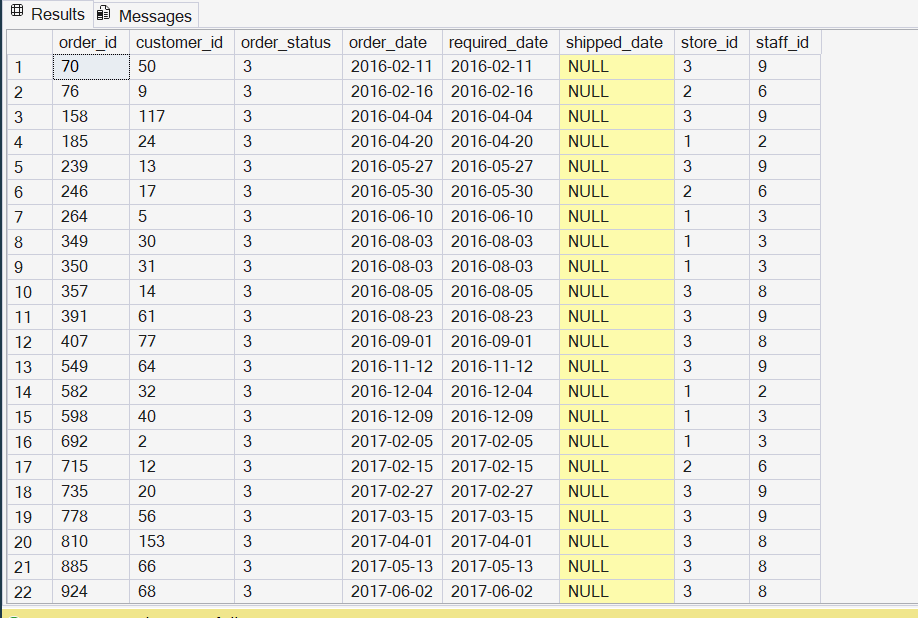
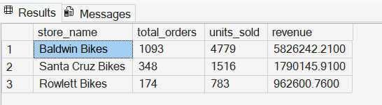
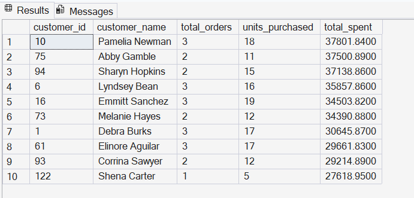

# 🚲 Bike Retail Data Engineering & Analytics Pipeline

An end-to-end data engineering project that transforms raw BikeStores CSV datasets into a structured SQL Server database using SSIS, followed by data quality validation and SQL-based business analysis.

## Project Overview

This project demonstrates a complete ETL workflow from raw CSV files to an analytics-ready relational database.

**Pipeline:**

Raw CSV Files → SSIS ETL → Data Cleaning & Transformation → SQL Server → Data Validation → Business Analysis

## Data Source

This project uses the **Bike Store Relational Database** dataset available on Kaggle. The dataset is a sample retail bike store database originally sourced from SQLServerTutorial.net and contains customer, product, inventory, store, staff, order, and order-item data.

**Source:** [Bike Store Relational Database | SQL - Kaggle](https://www.kaggle.com/datasets/dillonmyrick/bike-store-sample-database)

## Tech Stack

- **SQL Server** — Relational database and analytics
- **SSIS** — ETL pipeline development
- **SSMS** — Database management and SQL querying
- **Visual Studio** — SSIS package development
- **Git / GitHub** — Version control and project documentation

## Database Design

The final SQL Server database contains 9 relational tables:

`brands` · `categories` · `customers` · `stores` · `staffs` · `products` · `stocks` · `orders` · `order_items`

The database was designed around core retail entities including customers, orders, products, stores, staff, and inventory, with primary and foreign key relationships used to maintain referential integrity.

### Conceptual ER Diagram

An initial ERD was developed to model the major business entities, cardinalities, and relationships before implementation.

During implementation, the conceptual model was refined to align with the BikeStores source structure. For example, the initial product-category junction design was simplified by storing `category_id` as a foreign key in the `products` table, resulting in the final 9-table SQL Server schema.



### Relational Schema & Normalization

The conceptual model was translated into a normalized relational schema consisting of 9 SQL Server tables with defined primary and foreign key relationships.

Functional dependencies were reviewed across the schema to validate table structure, reduce data redundancy, and maintain data integrity.

#### Final Relational Schema




#### Functional Dependency Diagram




## ETL Architecture

The ETL pipeline was developed in SSIS to extract raw CSV data, transform source fields when necessary, and load the data into SQL Server.

### SSIS Control Flow

The workflow follows a dependency-aware loading sequence to preserve foreign key relationships between tables.

**Load Sequence:**

`Reset Tables → Brands → Categories → Customers → Stores → Staffs → Products → Stocks → Orders → Order Items`

Green precedence constraints ensure that each downstream task executes only after the previous task completes successfully.

The complete ETL workflow was executed successfully after resolving data type, NULL handling, connection, and dependency issues.



All nine target tables were loaded successfully while preserving dependency order and referential integrity.

## Data Transformation

During the ETL process, several source fields required transformation before they could be loaded safely into SQL Server.

### NULL Handling for `shipped_date`

The source `orders.csv` file contains `"NULL"` values in the `shipped_date` column for orders that have not yet been shipped.

Directly converting the entire column to a date type caused SSIS conversion errors. To resolve this, the source column was first treated as a string and then transformed using a Derived Column component.

```text
shipped_date == "NULL"
    ? NULL(DT_DBDATE)
    : (DT_DBDATE)shipped_date
```



This transformation preserves missing shipping dates as SQL `NULL` values while converting valid date strings into the `DT_DBDATE` data type.

### Additional Data Preparation

Other ETL preparation steps included:

- Configuring UTF-8 source encoding
- Increasing string column widths to prevent truncation
- Converting numeric price and discount fields to appropriate decimal data types
- Converting `manager_id` source `"NULL"` values into SQL `NULL`
- Aligning source and destination metadata before loading

### Row Count Validation

After the ETL pipeline completed, row counts were validated across all nine destination tables to confirm that the expected records were successfully loaded into SQL Server.

```sql
SELECT 'brands' AS table_name, COUNT(*) AS row_count FROM dbo.brands
UNION ALL
SELECT 'categories', COUNT(*) FROM dbo.categories
UNION ALL
SELECT 'customers', COUNT(*) FROM dbo.customers
UNION ALL
SELECT 'stores', COUNT(*) FROM dbo.stores
UNION ALL
SELECT 'staffs', COUNT(*) FROM dbo.staffs
UNION ALL
SELECT 'products', COUNT(*) FROM dbo.products
UNION ALL
SELECT 'stocks', COUNT(*) FROM dbo.stocks
UNION ALL
SELECT 'orders', COUNT(*) FROM dbo.orders
UNION ALL
SELECT 'order_items', COUNT(*) FROM dbo.order_items;
```

| Table | Row Count |
|---|---:|
| brands | 9 |
| categories | 7 |
| customers | 1,445 |
| stores | 3 |
| staffs | 10 |
| products | 321 |
| stocks | 939 |
| orders | 1,615 |
| order_items | 4,722 |

### NULL Validation

The `shipped_date` field was validated after loading to confirm that unshipped orders were stored as true SQL `NULL` values rather than the source string `"NULL"`.

```sql
SELECT *
FROM dbo.orders
WHERE shipped_date IS NULL;
```

The validation confirmed that missing shipping dates were successfully preserved as SQL `NULL` values after the SSIS transformation.



### Referential Integrity Validation

Foreign key relationships were also validated to ensure that transactional records reference valid parent records.

For example, the following query checks for orders associated with nonexistent customers:

```sql
SELECT o.*
FROM dbo.orders o
LEFT JOIN dbo.customers c
    ON o.customer_id = c.customer_id
WHERE c.customer_id IS NULL;
```

The query returned 0 rows, indicating that no orphaned order records were found and that all customer_id values in the orders table reference valid customer records.


## SQL Business Analysis

After validating the ETL pipeline, SQL queries were used to analyze sales performance and extract business insights from the integrated BikeStore database.

### Top Products by Revenue

Product-level sales performance was analyzed using total units sold and revenue after discounts.

```sql
SELECT TOP 10
    p.product_name,
    SUM(oi.quantity) AS units_sold,
    ROUND(
        SUM(oi.quantity * oi.list_price * (1 - oi.discount)),
        2
    ) AS revenue
FROM dbo.order_items oi
JOIN dbo.products p
    ON oi.product_id = p.product_id
GROUP BY p.product_name
ORDER BY revenue DESC;
```


**Key Insight:** Trek Slash 8 27.5 - 2016 generated the highest revenue at approximately **$616K**, with **154 units sold**. Several other Trek models also ranked among the top-performing products.

### Store Performance

Store-level performance was analyzed by combining order and order item data to compare total orders, units sold, and revenue across locations.

```sql
SELECT
    s.store_name,
    COUNT(DISTINCT o.order_id) AS total_orders,
    SUM(oi.quantity) AS units_sold,
    ROUND(
        SUM(oi.quantity * oi.list_price * (1 - oi.discount)),
        2
    ) AS revenue
FROM dbo.stores s
JOIN dbo.orders o
    ON s.store_id = o.store_id
JOIN dbo.order_items oi
    ON o.order_id = oi.order_id
GROUP BY s.store_name
ORDER BY revenue DESC;
```




**Key Insight:** Baldwin Bikes was the strongest-performing location, generating approximately **$5.83M in revenue** from **1,093 orders** and **4,779 units sold**. This represented roughly **68% of total revenue across the three stores**, substantially outperforming Santa Cruz Bikes and Rowlett Bikes.

### Customer Analysis

Customer purchasing behavior was analyzed to identify the highest-value customers based on total spending, order frequency, and units purchased.

```sql
SELECT TOP 10
    c.customer_id,
    CONCAT(c.first_name, ' ', c.last_name) AS customer_name,
    COUNT(DISTINCT o.order_id) AS total_orders,
    SUM(oi.quantity) AS units_purchased,
    ROUND(
        SUM(oi.quantity * oi.list_price * (1 - oi.discount)),
        2
    ) AS total_spent
FROM dbo.customers c
JOIN dbo.orders o
    ON c.customer_id = o.customer_id
JOIN dbo.order_items oi
    ON o.order_id = oi.order_id
GROUP BY
    c.customer_id,
    c.first_name,
    c.last_name
ORDER BY total_spent DESC;
```




**Key Insight:** Pamelia Newman was the highest-value customer, generating approximately **$37.8K in total spending** across **3 orders** and **18 units purchased**. Abby Gamble followed closely with approximately **$37.5K from only 2 orders**, suggesting that customer value was influenced by both purchase frequency and average order value.


## Challenges & Solutions

Several data engineering challenges were encountered while building and executing the ETL pipeline. These issues required debugging across source data, SSIS transformations, SQL Server connections, and table dependencies.

### 1. NULL Date Handling

**Challenge:**  
The `shipped_date` column in the source CSV contained the string `"NULL"` for orders that had not yet been shipped. Directly converting the column to a SQL date type caused SSIS conversion errors.

**Solution:**  
The source field was initially treated as a string and transformed using an SSIS Derived Column:

```text
shipped_date == "NULL"
    ? NULL(DT_DBDATE)
    : (DT_DBDATE)shipped_date
```

This converted source `"NULL"` strings into true SQL `NULL` values while preserving valid shipping dates.

---

### 2. Data Type and Metadata Mismatches

**Challenge:**  
Several source columns did not initially match the SQL Server destination schema, causing conversion and truncation errors during loading.

**Solution:**  
Source metadata and destination data types were aligned by adjusting string lengths, configuring UTF-8 encoding, and converting numeric and date fields to compatible SQL Server data types.

---

### 3. Database Connection Configuration

**Challenge:**  
During pipeline development, the SSIS package initially failed to acquire the SQL Server connection used by the reset and loading tasks.

**Solution:**  
The connection manager configuration was corrected and the package was revalidated before execution. After updating the connection settings, the reset task and downstream ETL tasks executed successfully.

---

### 4. Foreign Key Load Dependencies

**Challenge:**  
Loading related tables in the wrong order could cause foreign key violations because child records depended on parent records that had not yet been loaded.

**Solution:**  
SSIS precedence constraints were used to enforce a dependency-aware loading sequence:

`Brands → Categories → Customers → Stores → Staffs → Products → Stocks → Orders → Order Items`

This ensured that parent tables were populated before dependent transactional tables.

## Project Structure

```text
BikeRetail-Data-Engineering/
│
├── README.md
│
├── ssis/
│   └── Package.dtsx
│
├── sql/
│   ├── data_validation.sql
│   └── business_analysis.sql
│
└── screenshots/
    ├── control_flow.png
    ├── data_flow.png
    ├── erd.png
    ├── null_handling.png
    ├── null_validation.png
    ├── top_products_revenue.png
    ├── store_performance.png
    └── customer_analysis.png
```

- `ssis/Package.dtsx` — SSIS package containing the complete ETL workflow from CSV sources to SQL Server.
- `sql/data_validation.sql` — SQL queries used to validate row counts, NULL handling, and referential integrity.
- `sql/business_analysis.sql` — SQL queries used for product, store, and customer-level business analysis.
- `screenshots/` — Visual documentation of the database design, SSIS ETL workflow, data transformations, validation results, and business analysis.

## Future Improvements

Potential enhancements to the pipeline include:

- **Automated ETL Execution** — Schedule the SSIS package using SQL Server Agent to support recurring data ingestion.
- **Incremental Loading** — Replace full-table reloads with incremental loading strategies to process only new or updated records.
- **Enhanced Error Handling** — Add SSIS error outputs, logging, and rejected-record handling to improve pipeline reliability and troubleshooting.
- **BI Integration** — Connect the SQL Server database to Power BI to build automated dashboards for sales, store, and customer performance.

## Skills Demonstrated

- ETL pipeline development with SQL Server Integration Services (SSIS)
- Relational database design and SQL Server data loading
- Data cleaning, transformation, and data type handling
- Data quality validation and referential integrity checks
- SQL joins, aggregations, and business analysis
- ETL debugging and dependency management
